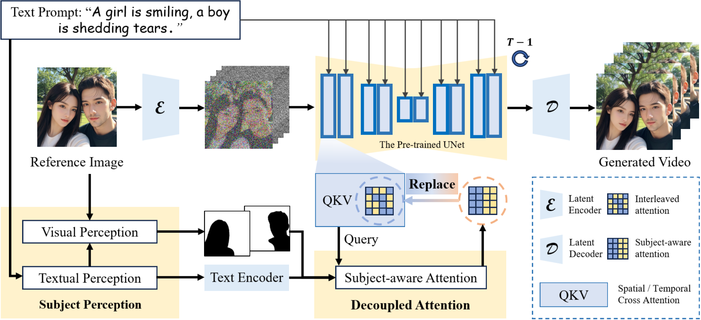
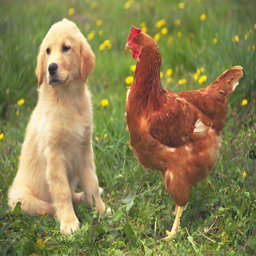
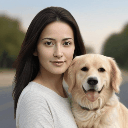
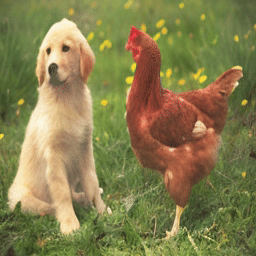

# FreeDeMo
<!-- ### This repo is under construction. Please stay tuned. -->

<!-- [**🌐 Homepage**](https://tiger-ai-lab.github.io/ConsistI2V/) | [**📖 arXiv**](https://arxiv.org/abs/2402.04324) | [**🤗 Model**](https://huggingface.co/TIGER-Lab/ConsistI2V) | [**📊 I2V-Bench**](https://drive.google.com/drive/folders/1eg_vtowKZBen74W-A1oeO4bR1K21giks) | [**🤗 Space**](https://huggingface.co/spaces/TIGER-Lab/ConsistI2V) | [**🎬 Replicate Demo**](https://replicate.com/wren93/consisti2v)
-->

This repo contains the codebase for "FreeDeMo: A Training-Free Decoupled Diffusion Model for Multi-Subject Image-to-Video Generation"


<!--We propose ConsistI2V, a diffusion-based method to enhance visual consistency for I2V generation. Specifically, we introduce (1) spatiotemporal attention over the first frame to maintain spatial and motion consistency, (2) noise initialization from the low-frequency band of the first frame to enhance layout consistency. These two approaches enable ConsistI2V to generate highly consistent videos.

-->


# Results
Below, we present some of the effects achieved through our work.


We also present some I2V videos.
<div align="center">
  <table>
    <tr>
      <td align="center" width="250px">
       
      </td>
      <td align="center" width="250px">
        
      </td>
      <td align="center" width="250px">
        
      </td>
    </tr>
    <tr>
      <td align="center">
        <b>a girl is smiling,a boy is nodding up and down.</b><br/>
      </td>
      <td align="center">
        <b>a girl is smiling,a dog is sticking out its tongue.</b><br/>
      </td>
      <td align="center">
       <b>a dog is barking,a chicken is turning back.</b>
      </td>
    </tr>
    <tr>
      <td align="center">
        
      </td>
      <td align="center">
        
      </td>
      <td align="center">
         
      </td>
    </tr>
  </table>
</div>


## Environment Setup
Prepare codebase and Conda environment using the following commands:
```
git clone https://github.com/hengliusky/FreeDeMo
cd ConsistI2V

conda env create -f environment.yaml
conda activate freeDeMo
```

## Inference
Although the pre-trained model we used is based on [ConsistI2V](https://huggingface.co/TIGER-Lab/ConsistI2V/tree/main), any other pre-trained video diffusion generation model can be used here. If you want to deploy our method, you will also need to download the weights for [GroundingDino](https://github.com/IDEA-Research/GroundingDINO) and [segment-anything](https://github.com/facebookresearch/segment-anything). After downloading these weights, you can run the sampling script using the following command:
```
python scripts/animate_seg.py \
    --inference_config configs/inference/inference_test.yaml \
    --path_to_first_frame "path to your image" \
    --format mp4 \
    --seed enter your seed \
    --frame_stride 2
```
We have several examples in the assets directory that you can run the script with using the following code:
```
sh assets/example/1_inference.sh
```

## Acknowledgements
Our codebase is built upon [ConsistI2V](https://github.com/TIGER-AI-Lab/ConsistI2V), [GroundingDino](https://github.com/IDEA-Research/GroundingDINO). Thanks for open-sourcing.
